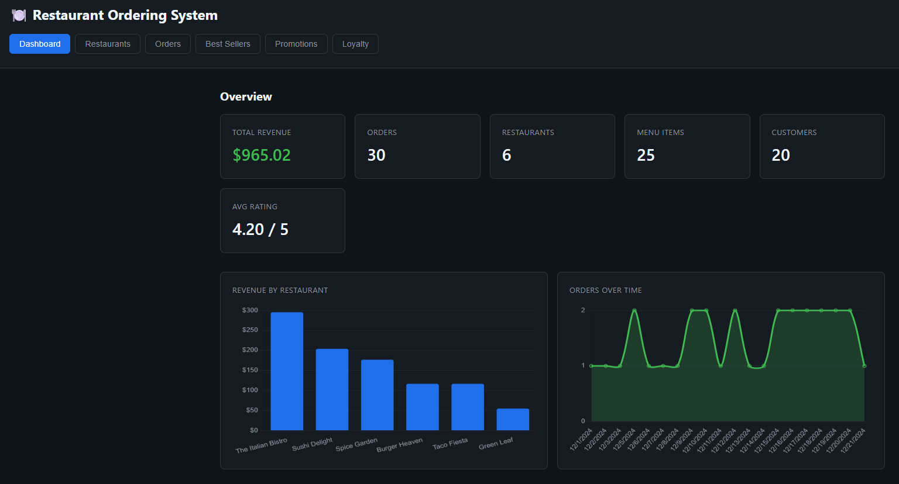
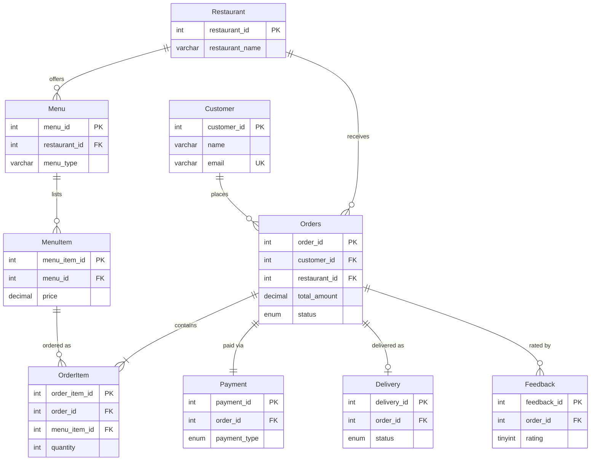

# 🍽️ Restaurant Ordering System Database with Analytics Dashboard

**Stack:** MySQL 8.0+ · MySQL Workbench, `mysql` CLI, or any client.

This is a 22-table MySQL schema for a multi-restaurant ordering platform containing orders, payments, deliveries, reservations, recipes, suppliers, and a loyalty point ledger. Built to demonstrate normalized schema design and analytical SQL (CTEs, window functions, anti-joins), and paired with a read-only Node.js dashboard that visualizes the schema.



## Schema

Order lifecycle with primary and foreign keys (full 22-table breakdown below)



| Domain | Tables |
|---|---|
| Customers & Loyalty | `Customer`, `LoyaltyProgram`, `LoyaltyTransaction` |
| Restaurants & Staffing | `Restaurant`, `RestaurantHours`, `Employee`, `Shift` |
| Menus & Inventory | `Menu`, `Category`, `MenuItem`, `Ingredient`, `MenuItemIngredient`, `Supplier`, `SupplierIngredient` |
| Orders & Fulfillment | `Orders`, `OrderItem`, `Payment`, `Invoice`, `Delivery` |
| Front of House | `Tables`, `Reservation` |
| Marketing & Feedback | `Promotions`, `Feedback` |

## Files

`databasemodel.sql` (schema) · `inserts.sql` (sample data) · `run.sql` (one-shot rebuild) · `queries.sql` + `advanced_queries.sql` (analytics)

## Quick Start

Open `run.sql` in MySQL Workbench and execute. The script drops any existing `RestaurantOrderingSystemDB`, rebuilds the schema, loads sample data, and prints a success message.

## Analytics Dashboard

A read-only Node.js + Express dashboard in `dashboard/` visualizes the schema. This dashboard contains stat cards, revenue and orders charts, expandable order line items, promotions, and a loyalty leaderboard. It exists to verify that the schema holds up under realistic analytical queries; it is not a customer-facing ordering app.

1. Install Node 18+ from [nodejs.org](https://nodejs.org).
2. Make sure the database is loaded (see Quick Start above).
3. From the `dashboard/` directory:

   ```bash
   npm install
   cp .env.example .env       # then edit .env with your MySQL credentials
   npm start
   ```

4. Open <http://localhost:3000>.

---
**Author:** Matthew Li
